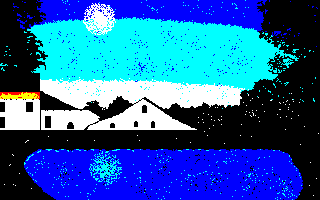

# AGS Background Blitz - Liquid

My entry for the [AGS Background Blitz - Liquid](https://www.adventuregamestudio.co.uk/forums/competitions-activities/background-blitz-liquid-deadline-december-1st/) competition.

The image is of the village pond, which I would like to create a retro mystery game around. I went for a retro pixel art look and only used six colours.

